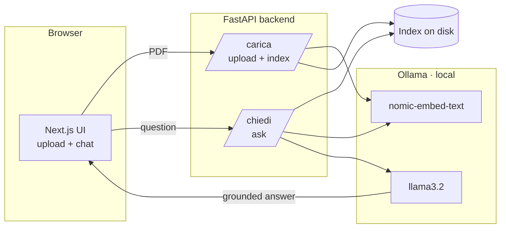

# Arcane famAIliar 🔮

> A local, privacy-first RAG assistant that answers questions about any PDF document — powered by Ollama, running entirely on your machine.

## Overview

**Arcane famAIliar** is a Retrieval-Augmented Generation (RAG) assistant that lets you ask natural-language questions about any PDF and get answers grounded in the source material — not hallucinated. Upload a document through the web interface, ask a question, and it retrieves the relevant passages and generates an answer based only on them. If the answer isn't in the document, it says so instead of making something up.

Built entirely with local models (via Ollama), it runs offline, costs nothing to query, and keeps your documents private — a real advantage when working with sensitive material.

*Personal note: I built this mainly to query the rulebooks of tabletop RPGs I love — but it works on any PDF: technical docs, manuals, contracts, research papers.*

## How it works

The project is a small full-stack app: a **Next.js frontend** (chat + PDF upload) talking to a **FastAPI backend** that runs the RAG pipeline against local **Ollama** models.



The pipeline splits into an **indexing** phase (when you upload a PDF) and an instant **query** phase (when you ask a question):

**Indexing (runs when a PDF is uploaded):**
1. **PDF extraction** — text is pulled from every page (`pypdf`)
2. **Chunking** — the raw text is split into fixed-size chunks (~1000 chars)
3. **Embedding** — each chunk becomes a 768-dimension vector capturing its meaning (`nomic-embed-text`)
4. **Caching** — chunks and embeddings are persisted to disk, so this slow step runs only once per document

**Querying (instant):**
1. The saved index is loaded into memory
2. The question is embedded and compared to every chunk via cosine similarity
3. The most relevant chunks are passed to the LLM as context
4. The model (`llama3.2`) answers grounded *only* in that context — and admits when the answer isn't there

Uploading a new PDF **replaces** the current index, and the backend reloads it in memory immediately — so the chat starts answering about the new document without a restart.

## Tech stack

**Backend**
- **Python** — core language
- **FastAPI + uvicorn** — async web API exposing the assistant over HTTP
- **Ollama** — local model inference (no API keys, no cloud, no cost)
- **nomic-embed-text** — embedding model for semantic search
- **llama3.2** — generation model
- **httpx** — direct HTTP calls to the Ollama API (chosen over the SDK for explicit timeout control)
- **pypdf** — PDF text extraction
- **uv** — fast, modern dependency & environment management

**Frontend**
- **Next.js + TypeScript** — the web app (chat interface + upload modal)
- **Tailwind CSS** — styling

**Infrastructure**
- **Docker + Docker Compose** — the whole stack (frontend + backend) runs with a single command

## Getting started

The fastest way to run everything is Docker. A manual setup is documented below if you'd rather run the pieces yourself.

**Prerequisites (both paths):** [Ollama](https://ollama.com) installed and running on your machine, with the models pulled:

```bash
ollama pull nomic-embed-text
ollama pull llama3.2
```

> Ollama runs on the **host machine** in both setups — including the Docker one, where the backend reaches it via `host.docker.internal`.

### Option A — Docker (recommended)

Requires [Docker Desktop](https://www.docker.com/products/docker-desktop/).

```bash
# 1. Clone and enter the project
git clone https://github.com/LeoDS99/arcane-famAIliar.git
cd arcane-famAIliar

# 2. Start the whole stack (frontend + backend)
docker compose up --build
```

Then open **http://localhost:3000**, upload a PDF in the modal, wait for indexing to finish, and start asking questions.

### Option B — Manual

Requires [uv](https://docs.astral.sh/uv/) and [Node.js](https://nodejs.org/).

```bash
# 1. Clone and enter the project
git clone https://github.com/LeoDS99/arcane-famAIliar.git
cd arcane-famAIliar

# 2. Backend — install deps and start the API
uv sync
uv run uvicorn src.api:app

# 3. Frontend — in a second terminal
cd frontend
npm install
npm run dev
```

Open **http://localhost:3000** and use the app as above.

<details>
<summary>Indexing a PDF from the command line (optional)</summary>

You can also build an index directly, without the web UI. Place a PDF in `documenti/`, point the script at it, then run it as a module (the package uses `src.`-prefixed imports):

```bash
uv run python -m src.indicizza
```

</details>

## Configuration

The backend reads the Ollama address from the `OLLAMA_HOST` environment variable, defaulting to `http://localhost:11434`. Docker Compose sets it to `http://host.docker.internal:11434` so the containerized backend can reach Ollama on the host.

## The AI-assisted approach

I built this project as a hands-on way to move from front-end development into AI engineering. I used AI as a **tutor** — explaining concepts, unblocking errors, reviewing my code — while writing every line myself and making the design decisions.

The goal wasn't to generate code I don't understand. It was the opposite: to learn by building, breaking things, and reading errors, so I can **explain every part of this repository**. AI accelerated the learning; it didn't replace it.

## Copyright & license

The code in this repository is released under the MIT License.

**Documents are not included.** RPG rulebooks and most PDFs are copyrighted, so no source documents are committed to this repo — you provide your own by uploading them through the app (the `documenti/`, `uploads/`, and index files are git-ignored). For a fully reproducible demo, use a freely licensed System Reference Document (SRD).