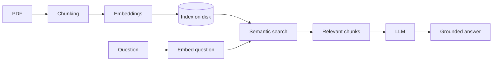

# Arcane famAIliar 🔮

> A local, privacy-first RAG assistant that answers questions about any PDF document — powered by Ollama, running entirely on your machine.

## Overview

**Arcane famAIliar** is a Retrieval-Augmented Generation (RAG) assistant that lets you ask natural-language questions about any PDF and get answers grounded in the source material — not hallucinated. Point it at a document, ask a question, and it retrieves the relevant passages and generates an answer based only on them. If the answer isn't in the document, it says so instead of making something up.

Built entirely with local models (via Ollama), it runs offline, costs nothing to query, and keeps your documents private — a real advantage when working with sensitive material.

*Personal note: I built this mainly to query the rulebooks of tabletop RPGs I love — but it works on any PDF: technical docs, manuals, contracts, research papers.*

## How it works



The pipeline is split into an offline **indexing** phase and an instant **query** phase:

**Indexing (run once per document):**
1. **PDF extraction** — text is pulled from every page (`pypdf`)
2. **Chunking** — the raw text is split into fixed-size chunks (~1000 chars)
3. **Embedding** — each chunk becomes a 768-dimension vector capturing its meaning (`nomic-embed-text`)
4. **Caching** — chunks and embeddings are persisted to disk, so this slow step runs only once

**Querying (instant):**
1. The saved index is loaded from disk
2. The question is embedded and compared to every chunk via cosine similarity
3. The most relevant chunks are passed to the LLM as context
4. The model (`llama3.2`) answers grounded *only* in that context — and admits when the answer isn't there

## Tech stack

- **Python** — core language
- **Ollama** — local model inference (no API keys, no cloud, no cost)
- **nomic-embed-text** — embedding model for semantic search
- **llama3.2** — generation model
- **httpx** — direct HTTP calls to the Ollama API (chosen over the SDK for explicit timeout control)
- **pypdf** — PDF text extraction
- **uv** — fast, modern dependency & environment management

## Getting started

**Prerequisites:** [Ollama](https://ollama.com) installed and running, and [uv](https://docs.astral.sh/uv/).

```bash
# 1. Clone and enter the project
git clone https://github.com/LeoDS99/arcane-famAIliar.git
cd arcane-famAIliar

# 2. Install dependencies
uv sync

# 3. Pull the models
ollama pull nomic-embed-text
ollama pull llama3.2

# 4. Add a PDF to the documenti/ folder
#    (any PDF works — for a free, shareable example, grab an open SRD)

# 5. Build the index (slow, runs once)
uv run src/indicizza.py

# 6. Ask questions!
uv run src/retrieval.py
```

## The AI-assisted approach

I built this project as a hands-on way to move from front-end development into AI engineering. I used AI as a **tutor** — explaining concepts, unblocking errors, reviewing my code — while writing every line myself and making the design decisions.

The goal wasn't to generate code I don't understand. It was the opposite: to learn by building, breaking things, and reading errors, so I can **explain every part of this repository**. AI accelerated the learning; it didn't replace it.

## Copyright & license

The code in this repository is released under the MIT License.

**Documents are not included.** RPG rulebooks and most PDFs are copyrighted, so no source documents are committed to this repo — you provide your own by placing them in `documenti/` (which is git-ignored). For a fully reproducible demo, use a freely licensed System Reference Document (SRD).